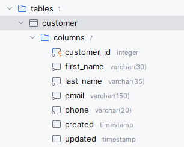
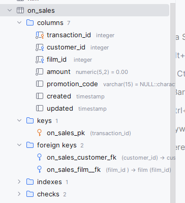
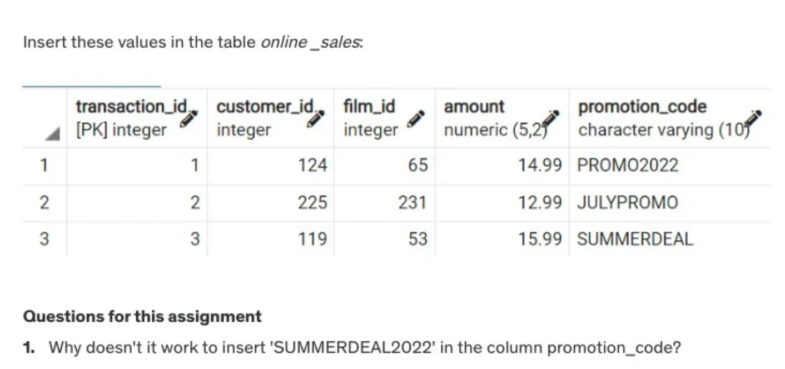
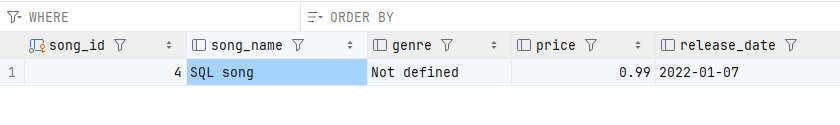

# Homework Database - 1
---
## Challenge 1:
---
### Create a table called customer with the following columns
- customer_id (integer, primary key)
```SQL
alter table customer
    add customer_id integer not null;

alter table customer
    add constraint customer_pk
        primary key (customer_id);
```

- first_name (varchar(30), NOT NULL)
```SQL
alter table customer
    add first_name varchar(30) not null;
```
- last_name (varchar(35), NOT NULL)
```SQL
alter table customer
    add last_name varchar(35) not null;
```
- email (varchar(150), NOT NULL)
```SQL
alter table customer
    add email varchar(150) not null;
```

- phone (varchar(20), NOT NULL)
```SQL
alter table customer
    add phone varchar(20) not null;
```
- created (timestamps without timezone )
```SQL
alter table customer
    add created timestamp without time zone;
```
- updated (timestamps without timezone )
```SQL
alter table customer
    add updated timestamp without time zone;
```



---
### Create a table called film with following columns:
- film_id (integer, primary key)
```SQL
alter table film
    add film_id integer not null;

alter table film
    add constraint film_pk
        primary key (film_id);
```
- name (varchar(30), NOT NULL)
```SQL
alter table film
    add name varchar(30) not null;
```
- is_new (bool, DEFAULT True)
```SQL
alter table film
    add is_new bool default true;

```
- created (timestamps without timezone )
```SQL
alter table film
    add created timestamp without time zone;
```
- updated (timestamps without timezone )
```SQL
alter table film
    add updated timestamp without time zone;
```


---
### Create a table called on_sales with following columns:
- transaction_id (integer, primary key)
```SQL
alter table on_sales
    add transaction_id integer not null;

alter table on_sales
    add constraint on_sales_pk
        primary key (transaction_id);
```
- customer_id (integer, foreign key referencing relevant table)
```SQL
alter table on_sales
    add customer_id integer not null;

alter table on_sales
    add constraint on_sales_customer_fk
        foreign key (customer_id) references customer ("customer_id");
```
- film_id (integer, foreign key referencing relevant table)
```SQL
alter table on_sales
    add "film_id " integer not null;

alter table on_sales
    add constraint on_sales_film__fk
        foreign key ("film_id ") references film ("film_id");
```
- amount (decimal(5,2) NOT NULL CHECK (amount ≥ 0.00 and amount ≤ 999.99))
```SQL
alter table on_sales
    add amount decimal(5, 2) not null default 0.00
        check ( amount >= 0 and amount <= 999.99 );
```
- promotion_code (varchar(15) DEFAULT None CHECK (length(promotion) ≤ 10)
```SQL
alter table on_sales
    add promotion_code varchar(15) default null
        check (char_length(promotion_code) <= 10);
```
- created (timestamps without timezone )
```SQL
alter table on_sales
    add created timestamp without time zone;
```
- updated (timestamps without timezone )
```SQL
alter table on_sales
    add updated timestamp without time zone;
```


---

- Trả lời: Vì ta đã giới hạn số lượng ký tự cho promotion code là 10 bằng lệnh ```CHECK``` nên khi insert data vào chỉ lấy đúng 10 ký tự, bỏ 4 ký tự còn lại.

---
## Challenge 2:
---
### Create a table called songs with following columns:


- During creation add the DEFAULT ‘Not defined’ to the genre
- After create table, add not null constaint to song_name column
```SQL
alter table songs
    alter column song_name set not null;
```
- After create table, add contraint with default name to ensure the price is least 1.99
```SQL
alter table songs
    add check ( price <= 1.99 );
```
- After create table, add contraint date_check to ensure the release date is between today and 01-01-1995
```SQL
alter table songs
add constraint date_check
check ( release_date between date '1995-01-01' and CURRENT_DATE);
```
- We want to add this row


```SQL
insert into songs (song_id, song_name, price, release_date)
values (4,'SQL song', 0.99, date '2022-01-07');
```


---
## Challenge 3 :
### Create database with ERD:
---
Step by Step:
- ERD analysis: 
    - entities: tables
    - columns of tables
    - Primary key 
    - Relationship (Foreign Key).
- Important principles: Create (no Foreign Key) then create table containing FK.
---

- country
```SQL
alter table challenge_3.country
    add country_id integer,
    add country text,
    add last_update timestamp with time zone;

alter table challenge_3.country
    add constraint country_pk
    primary key (country_id);
```

- city
```SQL
alter table challenge_3.city
add city_id integer not null,
add city text not null ,
add country_id  integer ,
add last_update timestamp with time zone;

alter table challenge_3.city
    add constraint city_pk
        primary key (city_id);

alter table challenge_3.city
    add constraint  city_fk
        foreign key (country_id) references challenge_3.country(country_id);
```

- address
```SQL
alter table challenge_3.address
add address_id integer not null ,
add address text,
add address2 text,
add district text,
add city_id integer,
add postal_code text,
add phone text,
add last_update timestamp with time zone;

alter table challenge_3.address
add constraint address_pk
primary key (address_id);

alter table challenge_3.address
add constraint address_fk
foreign key (city_id) references challenge_3.city(city_id);
```

